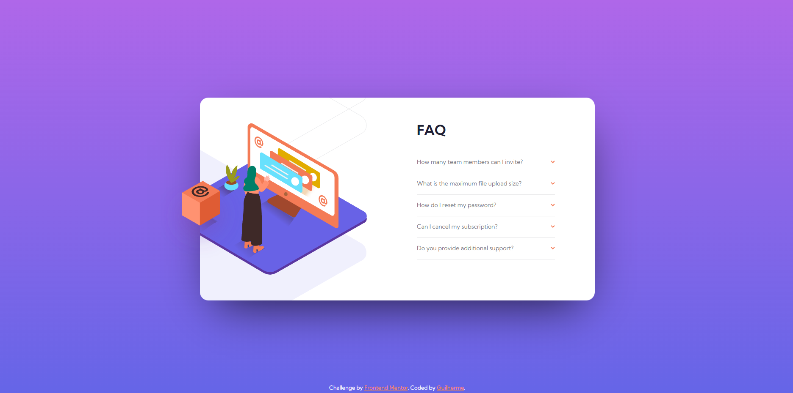
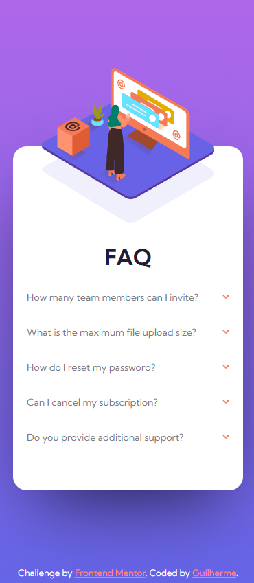

# Frontend Mentor - FAQ accordion card solution

This is a solution to the [FAQ accordion card challenge on Frontend Mentor](https://www.frontendmentor.io/challenges/faq-accordion-card-XlyjD0Oam). Frontend Mentor challenges help you improve your coding skills by building realistic projects. 

## Table of contents

- [Overview](#overview)
  - [The challenge](#the-challenge)
  - [Screenshot](#screenshot)
  - [Links](#links)
- [My process](#my-process)
  - [Built with](#built-with)
  - [What I learned](#what-i-learned)

 

______

 

## Overview

### The challenge
 
Your challenge is to build out this FAQ accordion card and get it looking as close to the design as possible.

You can use any tools you like to help you complete the challenge. So if you've got something you'd like to practice, feel free to give it a go.

Your users should be able to:

- View the optimal layout for the component depending on their device's screen size
- See hover states for all interactive elements on the page
- Hide/Show the answer to a question when the question is clicked
- **Bonus**: Complete the challenge without using JavaScript
 

______

 

### Screenshot

 

 

______

 

### Links

- Solution URL: [https://www.frontendmentor.io/solutions/faq-accordion-ljjux83N3K](https://www.frontendmentor.io/solutions/faq-accordion-ljjux83N3K)
- Live Site URL: [https://guisegatto.github.io/FAQ-Accordion/](https://guisegatto.github.io/FAQ-Accordion/)

 

______

 

## My process
 

### Built with

- Semantic HTML5 markup
- CSS custom properties
- Flexbox
- Mobile-first workflow
- Javascript

 

### What I learned

I learned how to make an accordion using Javascript and how to overflow an image.

